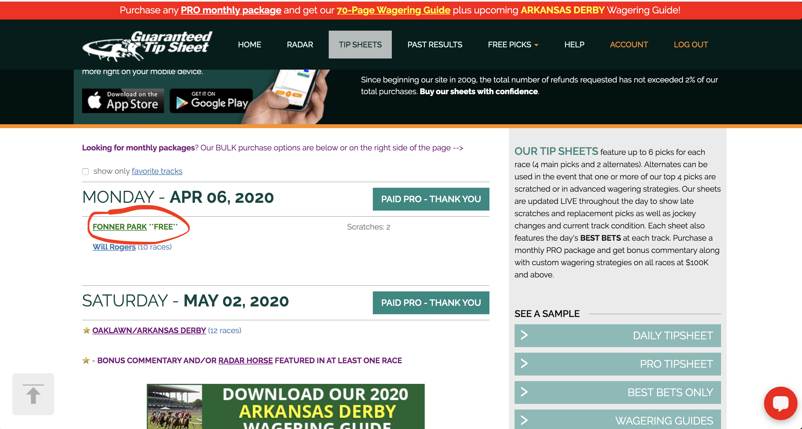
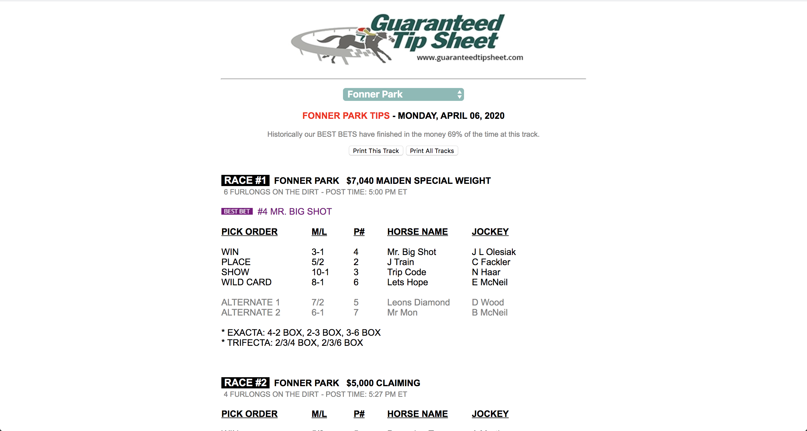
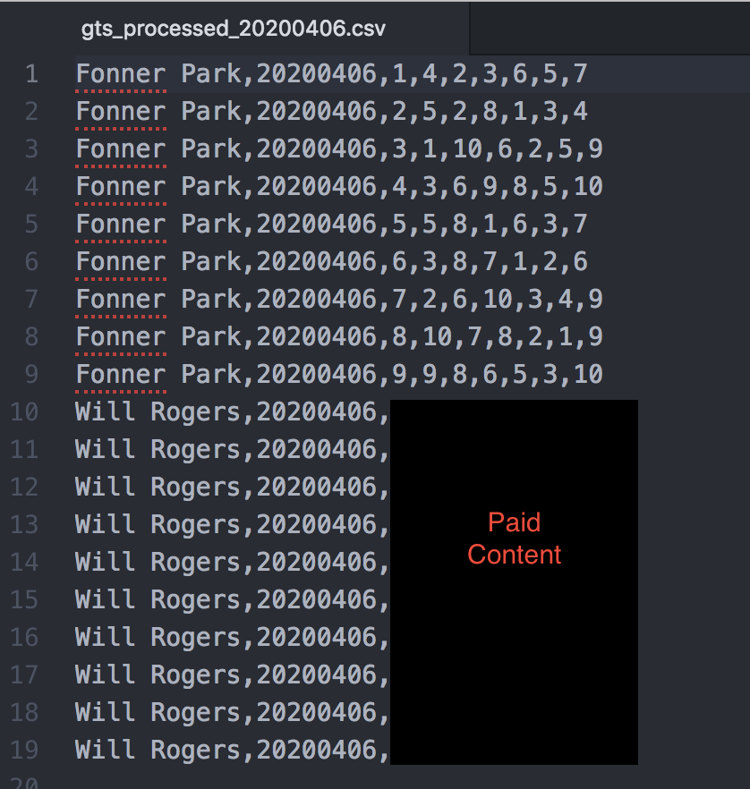

# X8313 Web Scraper
Showcasing key functionality from X8313 Inc: This is a functional web scraper for a paid subscription of guaranteedtipsheet.com (GTS), a horse-race hadicapper service. 

In order to do data-analysis, you need processed, clean data that is consistently available programatically. In other words, we need to change the format from the web-browser to something more structured like a csv file. This is the basic idea behind web-scraping. The following pictures will help illustrate the process. 

## guaranteedtipsheet.com

## click on Fonner Park (today's free content)

## the csv file after web content has been scraped and processed

**Instructions:**
1. `git clone` this repository
1. create and activate a new virtual environment
1. run `pip install -r requirements.txt` to install all package requirements
1. run `cp config/sample_config.hjson config/config.hjson` to copy the sample config file into a new config file 
1. use your favorite text editor to edit the contents of config.hjson according to your GTS username/pw and desired output
1. run `python gts_web_scraper.py` to scrape today's race data and voila

There should now be a new file in your configured output directory with processed data. Enjoy.
